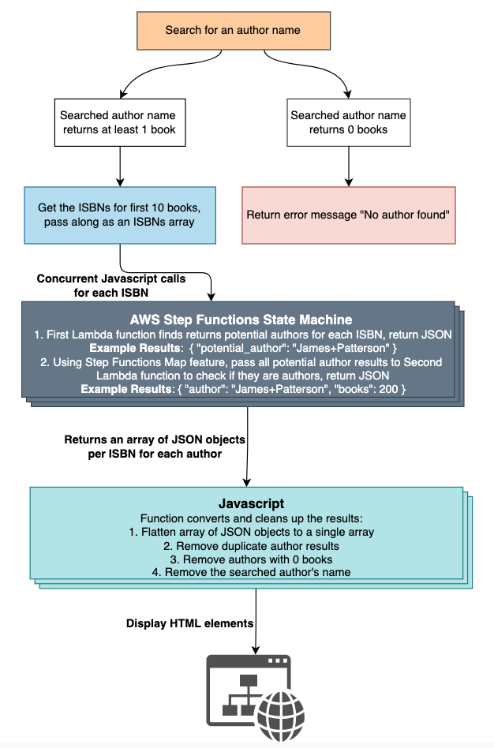

# next-read

I just finished reading a book, what's next? 

Typically I find new authors through their book endorsements found on the cover of the book I just read. However, I have not found a website that helps you find new authors by finding them through their endorsements of other authors. So I created **NextRead**.

Please check out my website here [NextRead](https://matthewsechrist.cloud/nextread.html)

The main technologies used in making this project include:

1. API Gateway - I use a simple REST API as the front-end to pass in the ISBN for processing.
2. Lambda functions - I wrote one Lambda function which passes in the ISBN to get the potential authors array, and a second Lambda function which verifies which potential authors are actual authors.
3. AWS Step Functions - Below shows the flow of my State Machine, which passes in the ISBN, and returns all consecutive words that are in the title case. Then, I use Step Function mapping to call my second Lambda function for each JSON object result from my first Lambda function. This is extremely fast and powerful running them concurrently for each ISBN.

**Disclaimer: This project is not related to my current job with NIWC Atlantic or the Department of Navy whatsoever.**
